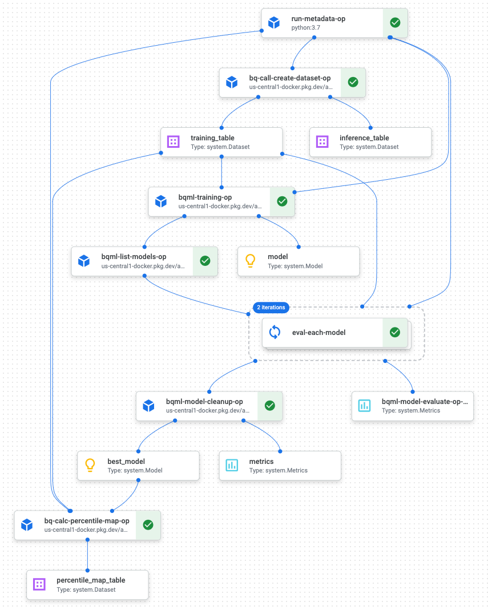

# VAI-MLOps (AnDY)
## Table of Contents
- [Installation Checklist](#installation-checklist)

- [System Overview](#system-overview)

  -  [Training Pipeline](#training-pipeline)

  -  [Prediction Pipeline](#prediction-pipeline)

  -  [Current Support](#current-support)

- [Prepare AnDY for Deployment](#prepare-andy-for-deployment)

  - [Model Creation](#model-creation)

  - [Activating on Model Results](#activating-on-model-results)

  - [Creating the Configuration YAML](#creating-the-configuration-yaml)

- [Deploying/Destroying AnDY](#deployingdestroying-andy)

- [Appendix](#appendix)

  - [Environment Setup](#environment-setup)

  - [Key Reporting](#key-reporting)


## Installation Checklist
Steps to be executed by the user are as follows:
- [ ] [Prerequisites](#prerequisites)

- [ ] [Clone this repo](#step-1-clone-this-repo)

- [ ] [Setup deployment environment](#step-2-setup-deployment-environment)

    - [ ] [Authentication for Google Cloud](#authentication-for-google-cloud)

    - [ ] [Python Environment](#python-environment)

- [ ] [Configure sp_create_dataset.sqlx](#step-3-configure-create-dataset-file)

- [ ] [Configure sp_create_activation.sqlx](#step-4-configure-create-activation-file)

- [ ] [Configure config.yaml](#step-5-configure-configyaml)

- [ ] [Deploy with Terraform](#step-6-deploy-with-terraform)

### Prerequisites
#### Software Requirements
- [ ] [Create GCP project](https://cloud.google.com/resource-manager/docs/creating-managing-projects#creating_a_project) and [Enable Billing](https://cloud.google.com/billing/docs/how-to/modify-project)

- [ ] Set up [Google Analyics 4 Export](https://support.google.com/analytics/answer/9823238?hl=en#zippy=%2Cin-this-article) to BigQuery

- [ ] Install git [installed](https://github.com/git-guides/install-git) 
    - Note: This is not necessary if deploying from the GCP Terminal

- [ ] Install [Terraform](https://developer.hashicorp.com/terraform/tutorials/aws-get-started/install-cli)
    - Note: This is not necessary if deploying from the GCP Terminal

- [ ] [Install the GCloud CLI](https://cloud.google.com/sdk/docs/install) 
    - Note: This is ONLY necessary if deploying from a local repository (i.e. NOT on the GCP Terminal)

- [ ] Have existing Google Analytics 4 property with a [Measurement ID](https://support.google.com/analytics/answer/12270356?hl=en)
    - Note: This is ONLY necessary if activating on the model results in GA4

#### Permissions
- [ ] Give the person deploying the system "Project Editor" permission in the GCP Project

- [ ] (If activation is via GA4) Provide the person deploying the system Google Analytics Property Editor or Owner 

### Step 1. Clone this Repo

#### Locally

1. In a local Terminal/Shell, navigate to the directory you would like to store the repo in

2. Run `git clone git@bitbucket.org:analyticspros/vai-mlops.git`

#### In the Google Cloud Platform Shell

1. Navigate to the [AnDY repo](https://bitbucket.org/analyticspros/vai-mlops/src/main/)

2. Download the repository into a zip file

3. Navigate to your Google Cloud Project and [open the Terminal](https://cloud.google.com/shell/docs/launching-cloud-shell)

4. [Upload](https://cloud.google.com/shell/docs/uploading-and-downloading-files) the zip file to your GCP Terminal instance

5. Navigate to the locaiton of the zip file in the terminal and run `unzip <filename>`

### Step 2. Setup Deployment Environment

#### Authentication for Google Cloud

##### Locally

1. Follow the instructions found [here](#gcloud-sdk)

##### In the Google Cloud Platorm Shell

If you set `create_ga4_setup` to `True`, you must authenticate with additional scopes. Follow the instructions [here](#authenticate-w-ga4-auto-setup) to do so. 

If you `create_ga4_setup` is set to `False`, no extra authentication is needed in the GCP Shell. 

#### Python Environment

1. Follow the instructions found [here](#python)

### Step 3. Configure Create Dataset File

1. Copy or rename the sp_create_dataset.sqlx.tpl file to `sp_create_dataset.sqlx`

2. Adjust the document, as instructed [here](#create-dataset-procedure)

### Step 4. Configure Create Activation File

1. Copy or rename the sp_ga4mp_activation.sqlx.tpl file to `sp_ga4mp_activation.sqlx`

2. Adjust the document, as instructed [here](#activation-query)

    - Ensure that any event parameters you want to send to GA4 are in the resultant data as ep_<event_paramter_name>

    - Ensure that any user properties you want to send to GA4 are in the resultant data as up_<user_property_name>

### Step 5. Configure config.yaml

1. Copy or rename the config.yaml.tpl file to `config.yaml`

2. Adjust the values in the document, as instructed [here](#creating-the-configuration-yaml)

### Step 6. Deploy with Terraform

1. Follow the steps outlined [here](#deploy-andy-pipelines)

## System Overview

The VAI-MLOps project is your solution for seamless ML model deployment, encompassing both training and prediction 
pipelines in the Google Cloud Platform. It empowers you to focus on the creative aspects of feature engineering and 
modeling while ensuring a reliable transition to production following MLOps best practices. Moreover, it offers the 
option to effortlessly push predictions to external platforms such as Google Analytics 4 for activation.

At a high level, the system has two tasks that it can execute:
- Create a Training Pipeline
- Create a Prediction Pipeline

This README will discuss the technicality of those pipelines below. 

### Training pipeline

The training pipeline is created to facilitate assembling a dataset from new data and building a model using that dataset.
Once the model is built, it is compared to previously built models and the best of all of the models is created.  

Steps performed are as follows:

1. Create the training dataset

2. Perform training on the generated dataset

3. List all the models, including the newly trained model and historical ones.

4. Evaluate each model on the most recent test data

5. Select the best model (optionally, delete old models or retain a specified number of them)

6. Create a model prediction to percentile mapping table



#### Artifacts produced

`model_{training_run_id}` - This is the BQML model generated from the training run

`model_evals` table - stores all model evaluations for each training run, which are used to determine the best model

`model_percentile_map` table - This table provides predictions-to-percentiles mapping, which can 
be optionally used to facilitate the understanding of predictions

### Prediction pipeline

The prediction pipeline selects the best model from all historical models and executes and inference step, storing the 
predicted values in a table. Optionally, those predictions can be automatically sent to GA4 for activation. 

The prediction pipeline involves the following steps:

1. Choose the best model for the prediction run (there may be more than one model depending on the configuration)

2. Create an inference table for making predictions

3. Perform predictions

4. (Optional) Activate predictions in Google Analytics 4


#### Artifacts produced
Artifacts Produced
`predictions` table: This table is created or inserted into a new set of predictions from the latest prediction run.

`activation_ga4mp_log` table: This log records what has been sent to Google Analytics 4.


### Current Support

AnDY currently supports modeling and activation of the following.

#### Modeling

 - BQML
       * Training and prediction pipelines
       * Hyperparameter tuning via Vizier
       * Any model type ending in REGRESSOR or CLASSIFIER is supported
       * Special support for regressors and binary classification - percentile mapping table

 - Custom Vertex AI Registered Models
       * Prediction pipeline (only)
       * Supports any model type

#### Activation

 - Google Analytics 4 Measurement Protocol
 - Run a custom BigQuery stored procedure/routine

## Prepare AnDY for Deployment

Using this system can be thought of as three steps:

1. Providing necessary information to the system for [model creation](#model-creation)

2. Providing necessary information to the system for [activating on model results](#activating-on-model-results)

3. Enabling the system to access all of this information in the [Configuration](#creating-the-configuration-yaml)

These steps are outlined below.

### Model Creation
One piece of information is required to enable the creation (i.e. training) of models:

 - Create Dataset Procedure
 
#### Create Dataset Procedure

The "Create dataset" procedure is a way to provide your own dataset to the pipelines. 
To work seamlessly with the framework, it should adhere to a specific specification.

`sp_create_dataset.sqlx.tpl` file provides a template of how inputs and outputs should be handled.
Copy (or rename it) to `sp_create_dataset.sqlx`.

The template in this template file is an example of a binary classification problem, creating a dataset where 
the label 1 signifies a purchase made within the next lookahead days from the last session.

##### Input

The procedure accepts four required parameters:

 - `table_name` - table name of the resulting procedure run
 
 - `date_start` & `date_end` - determine the date range of the data returned
 
 - `mode` - either TRAINING or INFERENCE

##### Output (mode="TRAINING") 

Training table should follow below rules:

 - must be named `table_name`
 
 - must have a `label` column which represents the label/target to train on
 
 - must have a `data_split` column with values either [TRAIN, EVAL, TEST](https://cloud.google.com/bigquery/docs/hp-tuning-overview#data_split)
       * TRAIN is used for training
       * EVAL is used for evaluating hyper-parameters
       * TEST is used for final hyper-parameter tuning objective
 
 - should only include feature columns and the label

##### Output (mode="INFERENCE") 

Inference table should follow below rules:

 - must be named `table_name`
 
 - must have a `date` column of type DATE (later used for table partitioning)
 
 - should include all feature columns
 
 - can include any other relevant columns one wants in the predictions table

### Activating on Model Results

#### Google Analytics 4 via Measurement Protocol

Four pieces of information are required to enable activation on model results in GA4:

 - GA4 Property ID

 - GA4 Measurement ID
 
 - GA4 API Secret
 
 - Activation query

##### GA4 Property ID

This is found by...

1. Navigating to the desired property in GA4

2.  Navigate to Admin > Property Details

3. Copy the Property ID at the top right of the screen


##### GA4 Measurement ID

This is found by...

1. Navigating to the desired property in GA4

2. Navigate to Admin > Data Streams > \[Select desired datastream]>

3. Copy the Measurement ID

##### GA4 API Secret

Create this by...

1. Navigating to the desired property in GA4

2. Navigate to Admin > Data Streams > \[Select desired datastream]>

3. Select "Manage Protocol API Secrets"

4. Select "Create", enter a nickname for the secret, then press "Create"

    - Try something like "Adswerve - AnDY"

5. Copy the Secret Value from the API secret that you just built

#### Notes on saving GA4 API secret in Secret Manager
If working with a GA4 rollup property one cannot send measurement protocol events to it. 
1. As a workaround a dictionary should be created in the following format:
```json
{
  "<stream_id>": {
    "property_id": "<value>",
    "measurement_id": "<value>",
    "api_secret": "<value>"
  },
  "<stream_id>": {...}
}
```
2. Save the dictionary in Secret Manager
 
3. Update the `config.yaml` by making:
   1. `ga4_measurement_id` should be set to "secret-manager"
   2. `ga4_api_secret` should be set to the secret name as assigned in Secret Manager

See [Creating the Configuration YAML](#creating-the-configuration-yaml) for configuration example, and see
[Activation Query](#####activation-query) to craft the query with an additional `stream_id` column.

The setup also works if you have a non-rollup property, but just wish to save the API secret in Secret Manager.

You can use the script found in `terraform/ga4_extract_secrets.py` to create a secrets for a given roll-up property,
or a classic property with multiple streams.
```cmd
python terraform/ga4_extract_secrets.py --property_id <ga4-property-id> --output ga4_secrets.json
```

##### Activation Query

`sp_ga4mp_activation.sqlx.tpl` provides an already working example of sending predictions as percentiles to GA4.
To use it copy (or rename it) to `sp_ga4mp_activation.sqlx`.

The template pushes all latest predictions that are new or have been changed in the past 7 days.

Activation query result columns should follow the following spec:

 - `client_id` [STRING] column (GA Client Id)
 
 - `event_name` [STRING] column to specify the name of the pushed event
 
 - `event_timestamp` [TIMESTAMP] column to specify the time of the event (at most 72 hours ago for the event to be valid)
 
 - `up_*` [STRING|INTEGER|FLOAT] column to specify a user property; replace the `*` with the name of the user property in GA4
 
 - `ep_*` [STRING|INTEGER|FLOAT] column to specify an event parameter; replace the `*` with the name of the event parameter in GA

 - (optional) `stream_id` [STRING] column to specify to which stream the data should be sent to. 
Only to be used when ga4_measurement_id and ga4_api_secret is saved in Secret Manager. See [here](####Notes on saving GA4 API secret in Secret Manager).
 - (optional) `user_id` [STRING] persistent user id such as logged-in id or account id
 - (optional) `user_data` [STRUCT] structure to support [user-provided data with user id](https://developers.google.com/analytics/devguides/collection/ga4/uid-data)
    - Review tests in `activation.ga4mp.test_pipeline.py` to be able to adequately structure the STRUCT in SQL and hash the data properly as well as review the documentation

**Notes on Automatic Custom Dimension Creation**

Any field that is named ep_\<sample_name\> or up_\<sample_name\> will automatically create a Custom Dimension with that name in your
GA4 property if `create_ga4_setup` is set to `true` in your configuration YAML (more details on this [here](#creating-the-configuration-yaml)). 
If, for some reason, you do NOT want these fields to be created as custom dimensions, add a training `_` to the field. This will indicate to the
AnDY system that you are not interested in storing that value in a custom dimension. 

*TL;DR* - Add a `_` to the end of any field you don't want to be created as a custom dimension.

**Notes on GA4 <> Google Ads integration**

If you are exporting the events as a conversion events to Google Ads, consider sending the propensity score
(multiplied by 100) as an event param (`ep_value_`). This will ensure that the "value" of the event is transferred over to Google Ads.
If `ep_value_` is added, `ep_currency_` is required.

Please note that you should add the trailing `_` in these field names. *`ep_value` and `ep_currency` are reserved fields in GA4 so we must
indicate to the system that we do NOT want to create those custom dimensions.*

```json
"events": [{ 
   "params": { 
       "currency": "USD", 
       "value": <DOUBLE> 
       ...
   } 
   ... 
]}
```

[GA4 MP Purchase Event Reference](https://developers.google.com/analytics/devguides/collection/protocol/ga4/reference/events#purchase)

#### BigQuery Stored Procedure/Routine

1. Create a custom BigQuery routine (`CREATE STORED PROCEDURE` command)
2. Routine will be called after the predictions step is completed.

Parameters can be passed to the routine in the config.yaml.
Parameter named run_id of type STRING will be automatically dynamically populated 
on each prediction run with a prediction run id if included.

```sql
CREATE OR REPLACE PROCEDURE `purchase_propensity.activation_routine`(run_id STRING, text STRING)
BEGIN

  SELECT run_id, text;

END;
```

Example use case: Use BigQuery routine to export data to GCS via EXPORT DATA command.

### Creating the Configuration YAML

After our necessary artifacts and information have been created for the pipelines, we need to create a config.yaml file. This file
will be able to store all necessary information for the system to run and instructs the system on which measures it needs to take
to construct the proper infrastructure. 

Create this config.yaml file by following these steps.

1. Copy `config.yaml.tpl` and name it config.yaml.
2. Fill in the values accordingly:
```yaml
gcp_project_id: your-project-id  # GCP Project Id where the pipelines, the BigQuery dataset and the models will live
gcp_region: us-central1
bq_dataset_id: purchase_propensity  # BQ dataset name where all models and tables will live
bq_stored_procedure_path: sp_create_dataset.sqlx  # Path to the create_dataset procedure
bq_sp_params:  # Custom create_dataset parameters
    lookback: 14
    lookahead: 7
    
model:
    type: BQML  # BQML or CUSTOM
    create_model_params:  # https://cloud.google.com/bigquery/docs/reference/standard-sql/bigqueryml-syntax-create-boosted-tree#create_model
        model_type: BOOSTED_TREE_CLASSIFIER
        hparam_tuning_objectives: ['ROC_AUC']
        num_trials: 10  # Number of trials for model hyper-parameter tuning
        category_encoding_method: ONE_HOT_ENCODING
        learn_rate: HPARAM_RANGE(0.00001, 1.0)
        l2_reg: HPARAM_RANGE(0, 10)
        max_tree_depth: HPARAM_RANGE(1, 16)
        subsample: HPARAM_RANGE(0.5, 1)
        max_iterations: 20
        early_stop: TRUE
        auto_class_weights: TRUE
      # Note: parameters that cannot be used, as they are reserved by the AnDY/GCP systems
      #   DATA_SPLIT_METHOD='CUSTOM', 
      #   DATA_SPLIT_COL='data_split',
      #   HPARAM_TUNING_ALGORITHM='VIZIER_DEFAULT',
      #   MODEL_REGISTRY='VERTEX_AI', 
      #   VERTEX_AI_MODEL_ID='{{ dataset_id }}' 

      # Note: 'transform' is a special parameter under 'create_model_params'. 
      #   A full TRANSFORM part of the model create needs to be put in.

training:
    cron: TZ=America/Los_Angeles 0 6 * * MON
    data_date_start_days_ago: 90  # How far back from today should we go to grab training data
    keep_n_best_models: 5  # How many models to keep saved (best model is always picked between retrains)

prediction:
    cron: TZ=America/Los_Angeles 0 11 * * *
    data_date_start_days_ago: 3  # How far back from today should we go to grab data for prediction

activation:
    ga4mp:  # GA4 Measurement Protocol based activation
        query_path: sp_ga4mp_activation.sqlx  # Path to the activation query
        ga4_measurement_id: J9D8V8M0V8  # secret-manager if this is saved in Secret Manager
        ga4_property_id: 318895463
        ga4_api_secret: ZdUboRUkQFicOlE6DVPzT3  # Secret Manager secret name if saved in Secret Manager
        ga4_mp_debug: True  # Use the prod GA4 MP endpoint or debug
        create_ga4_setup: False  # True means the conversion event and its params are created in GA4
    bq_routine:  # runs a BigQuery routine at the end of the prediction pipeline
        dataset_id: purchase_propensity  # dataset_id of where routine is saved
        routine_id: activation_routine 
        params:  # custom parameters to be pushed into your routine
            text: "Hello World!"
```

For more information on these fields, please see the [Appendix Section](#configuration-yaml-field-descriptions) dedicated to them.

## Deploying/Destroying AnDY

AnDY is deployed using Terraform: infrastructure as code. Every measure has been taken to make the deployment as seamless as possible
when using this framework. Terraform also enables the user to easily destroy the system and all associated artifacts. 

The following outline the steps that can be taken to deploy and destroy the system.

### Prerequisites
- (Optional) Set ```TF_VAR_config_path``` environment variable to the location of the configuration YAML file
  - The default location for this file will be ```./config.yaml```

### Deploy AnDY Pipelines
1. Navigate to parent directory of this project and activate the preconfigured python environment
1. Run: ```terraform init``` 

2. Run: ```terraform validate``` and fix errors, if any

3. Run: ```terraform apply```
  - (Optional) Run ```terraform apply -var="config_path=<location_to_config_yaml>"``` to specify the configuration location at runtime.

**Note:** 
At the end of the process please add Storage Admin permissions for the newly created bucket to the default compute engine service account (<project-number>-compute@developer.gserviceaccount.com).

### Destroy AnDY Pipelines
1. Run: ```terraform destroy```

### Destroy Specific Resource
1. Run: ```terraform destroy -target='resource.name'```

### Deploy Another Pipeline Using Terraform [Workspaces](https://developer.hashicorp.com/terraform/language/state/workspaces)
1. Create a new configuration YAML and  any other necessary files (i.e. sp_create_dataset.sqlx, etc.)

2. Run:  ```terraform workspace new <name of new pipeline>```

3. Run: ```terraform plan``` and ensure that the terraform plan makes sense

4. Execute the steps from [Run Pipeline Process](####run-pipline-process)
  
  - Ensure that you pass the config name as an argument if the new config is not in the default location (./config.yaml)

5. (Optional) To switch back to the original pipeline (or other pipelines)

  - Run: ```terraform workspace list```

  - Run: ```terraform workspace select <workspace name from 'list' command>```

### Artifacts of System Deployment

**BigQuery**

 - Dataset
 
 - create_dataset procedure

**Artifacts Registry**

 - Pipeline templates
 
 - Docker image

**Vertex AI**

 - Pipeline schedules

**Cloud Storage**

 - Bucket

# APPENDIX
## Environment Setup
### Python
We outline the processes for utilizing the Anaconda and venv virtual environment frameworks. However, any virtual environment should work. 
#### Anaconda
1. Open your terminal and navigate to the root folder of the project

2. Type: ```conda create --prefix ./env python=3.10```

   This will create a python 3.10 environment inside the root project folder

3. Type: ```conda activate ./env```

   This makes the environment active.

4. Type: ```pip install -r requirements.txt```

   This installs all necessary packages into the newly created environment

Depending on your IDE, you should be able to set this environment as the default for the project.

#### venv (Great if installing in the Google Cloud Platform Console)
1. Open your terminal and navigate to the root folder of the project

2. Type: ```python -m venv ./env```

   This will create a python 3.10 environment inside the root project folder

3. Type: ```source ./env/bin/activate```

   This makes the environment active.

4. Type: ```pip install -r requirements.txt```

   This installs all necessary packages into the newly created environment

Depending on your IDE, you should be able to set this environment as the default for the project.

### gcloud SDK
#### Authenticate w/o GA4 Auto-setup
1. Run `gcloud config configurations <desired name for config> --project <GCP project id> --account <the email of the user that will deploy the system> --activate`

    - Example: `gcloud config configurations create testing --project as-dev-christopher --account christopher.wilson@adswerve.com --activate`

2. Run `gcloud auth application-default login`

3. Follow the Redirect and Login to the Google Cloud Platform

#### Authenticate w/ GA4 Auto-Setup
If planning to use the GA4 setup which creates a conversion event and its parameters you must auth with:

1. Run `gcloud config configurations create <desired name for config> --project <GCP project id> --account <the email of the user that will deploy the system> --activate`

    - Example: `gcloud config configurations create testing --project as-dev-christopher --account christopher.wilson@adswerve.com --activate`

2. Run `gcloud auth application-default login --quiet --billing-project <GCP project id > --scopes="openid,https://www.googleapis.com/auth/userinfo.email,https://www.googleapis.com/auth/cloud-platform,https://www.googleapis.com/auth/sqlservice.login,https://www.googleapis.com/auth/analytics,https://www.googleapis.com/auth/analytics.edit,https://www.googleapis.com/auth/analytics.provision,https://www.googleapis.com/auth/analytics.readonly,https://www.googleapis.com/auth/accounts.reauth"`

    - Example: `gcloud auth application-default login --quiet --billing-project as-dev-christopher --scopes="openid,https://www.googleapis.com/auth/userinfo.email,https://www.googleapis.com/auth/cloud-platform,https://www.googleapis.com/auth/sqlservice.login,https://www.googleapis.com/auth/analytics,https://www.googleapis.com/auth/analytics.edit,https://www.googleapis.com/auth/analytics.provision,https://www.googleapis.com/auth/analytics.readonly,https://www.googleapis.com/auth/accounts.reauth"`

3. Follow the Redirect and Login to the Google Cloud Platform 

## Deploying Custom Models and Associated Training/Prediction Pipelines
See the `examples/custom_training_and_prediction` and `examples/custom_training_and_prediction_v2` for details on how to deploy a custom model and automate the custom training/prediction pipelines. 

## Key Reporting
### Segments and Bid Multipliers

```SQL
WITH 
  current_best_model AS (
    SELECT
      MAX(training_run_id) as training_run_id,
      MAX_BY(model_name, f1_score) as model_name
    FROM `project_id.dataset_id.model_evals` as me
    QUALIFY MAX(training_run_id) OVER() = training_run_id  # get latest trainign run
)
SELECT
  segment,
  ROUND(100 * conv_rate_base, 2) as conv_rate_all,
  ROUND(100 * SUM(conv_rate * (size_share/segment_size_share)), 2) as conv_rate_segment,
  ROUND(SUM(conv_rate * (size_share/segment_size_share)) / MAX(conv_rate_base), 2) as segment_multiplier,
  ROUND(SUM(100 * size_share), 2) as segment_size_pct,
  ROUND(100 * SUM(size_share * conv_rate), 2) as segment_size_converted,
  ROUND(100 * SUM(size_share * conv_rate) / SUM(SUM(size_share * conv_rate)) OVER(), 2) as segment_size_converted_pct,
FROM (
  SELECT
    *,
    SUM(size_share) OVER (PARTITION BY segment) as segment_size_share
  FROM (
    SELECT
      "D" || FLOOR(percentile/10) as segment,
      size_share,
      conv_rate,
      conv_rate_base
    FROM `project_id.dataset_id.model_percentile_map` as mpm
    INNER JOIN current_best_model as cbm USING (training_run_id, model_name)
  )
)
GROUP BY 1, 2
ORDER BY segment DESC
```
#### GA4 Measurement Protocol Status
General
```SQL
SELECT 
  prediction_run_ts,
  event_name,
  COUNTIF(state = 'SEND_OK 204') as success,
  COUNTIF(state != 'SEND_OK 204') as fail
FROM `project_id.dataset_id.activation_ga4mp_log` 
GROUP BY 1, 2
```
Detailed errors
```SQL
SELECT 
  prediction_run_ts,
  client_id,
  event_name,
  state,
  response,
  payload
FROM `project_id.dataset_id.activation_ga4mp_log` 
WHERE
  state != 'SEND_OK 204'
```

## Configuration YAML Field Descriptions 
Please find brief descriptions of the fields within the Configuration YAML file.

- gcp_project_id

    This is the project_id of the GCP project that will host the AnDY system. *Please note that this is **not** the Project NAME or Project NUMBER.*

- gcp_region

    This specifies the region that all system artificats will be hosted in. Available regions can be found [here](https://cloud.google.com/compute/docs/regions-zones#available).

- bq_dataset_id

    This is the name of the BigQuery dataset that will be created to host all model artifiacts. *Please note that this field is used in many naming conventions throughout the project so it is
    wise to choose a name that is descriptive of the model's purpose.*

- bq_stored_procedure_path

    This should be the path to the .sqlx file that contains the query which will create our training dataset. *Please note that, while the defaul value is `sp_create_dataset.sqlx`,
    if the user decides to change the name of this file, that **MUST** be reflected here.* 

- bq_sp_params

    This section of the YAML provides key-value pairs that will be used to fill dynamic variables within the file contained at bq_stored_procedure_path.
    For example, if the file contains a line

    ```DECLARE LOOKBACK_DAYS INT64 DEFAULT {{ bq_sp_params.lookback }};```,

    ...and our bq_sp_params contains a key-value pair of `loockback: 14`, then the query will evaluate to

    ```DECLARE LOOKBACK_DAYS INT64 DEFAULT 14;```


### model

- type

    This value can either be `BQML` or `CUSTOM`. 
    
    When `BQML`, the `create_model_params` value is required. This will enable the system to use BQML to train the model. 
    
    When `CUSTOM`, the system will use a model that the user has supplied through VertexAI. See the `examples/custom_training_and_prediction` and `examples/custom_training_and_prediction_v2` for details on how to deploy a custom model and automate the custom training/prediction pipelines. 

- create_model_params

    This portion of the YAML allows users to provide BQML-specific hyperparameters that will be utilized in model training. Available options are found [here](https://cloud.google.com/bigquery/docs/reference/standard-sql/bigqueryml-syntax-create-boosted-tree#create_model)

    Please note that there are parameters that cannot be used, as they are reserved by the AnDY/GCP systems. These include:
    - DATA_SPLIT_METHOD='CUSTOM', 
    - DATA_SPLIT_COL='data_split',
    - HPARAM_TUNING_ALGORITHM='VIZIER_DEFAULT',
    - MODEL_REGISTRY='VERTEX_AI', 
    - VERTEX_AI_MODEL_ID='{{ dataset_id }}' 

    - `transform` is a special parameter.

      A full TRANSFORM part of the model create needs to be supplied to this parameter.

### training

- cron

    This is a [cron](https://crontab.guru/) specification of the intervals at which the training pipeline should run.

- data_date_start_days_ago

    When the pipeline runs, it grabs data from within a certain time range. The model will be train on all data between `training run date` and `training run date - data_date_start_days_ago days`. 

- keep_n_best_models

    When the training pipeline runs, it evaluates all historic models and keeps on the best. This parameter will specify how many of the best models we would like to keep in our model registry. 


### prediction
This section provides details on when the prediction pipeline should run and the data we should use for the prediction process.

- cron

    This is a [cron](https://crontab.guru/) specification of the intervals at which the prediction pipeline should run.

- data_date_start_days_ago

    When the pipeline runs, it grabs data from within a certain time range. Predictions will be served on all users with data between `prediction run date` and `prediction run date - data_date_start_days_ago days`. 

### activation
This section provides details on enabling activation of the system. As of right now, the system only supports activation through the GA4 Measurement Protocol. Other activation methods will be supported in the future. 
#### ga4mp
This section of the YAML file contains values that are needed to allow the system to connect to a GA4 property and send values from our model to it.
- query_path

    This should be the path to the .sqlx file that contains your activation query. *Please note that, while the defaul value is `sp_ga4mp_activation.sqlx`,
    if the user decides to change the name of this file, that **MUST** be reflected here.* 

- ga4_measurement_id

    Details on where to find this value are found [here](#ga4-measurement-id)

    If working with a GA4 rollup or want to save the measurement id and api secret in Google Secret Manager the value
    should be 'secret-manager'.

- ga4_property_id

    Details on where to find this value are found [here](#ga4-property-id)

- ga4_api_secret

    Details on where to find this value are found [here](#ga4-api-secret)

    If working with a GA4 rollup or want to save the measurement id and api secret in Google Secret Manager the value
    should be the Secret Manager secret name.

- ga4_mp_debug

    When set to `True`, the activation processes will not send data to GA4. Instead, the prediction tables and pipelines will run
    and allow us to verify the performance of the system without sending and custom dimensions to our Google Analytics Property. This is a valuable
    feature to utilize while developing and verifying the performance of the model. 

- create_ga4_setup

    When set to `True`, the system will automatically create the infrastructure within your GA4 property
    to accept custom dimesions. This enables a more streamlined deployment process with less room for error in matching dimensions names and will enable
    a better activation experience.  

## Common Errors During Deployment

### Improper Auth
**Error**
```
Error running command 'python ./terraform/ga4_setup.py --config_path config.yaml -c': exit status 1. Output: Event name: `purchase_propensity`

...

google.api_core.exceptions.PermissionDenied: 403 Request had insufficient authentication scopes. [reason: "ACCESS_TOKEN_SCOPE_INSUFFICIENT"
```
**Solution**

*Even* if you are running the system in the GCP shell; if you set `create_ga4_setup` to `True`, you must authenticate with additional scopes. Follow the instructions [here](#authenticate-w-ga4-auto-setup) to do so. 